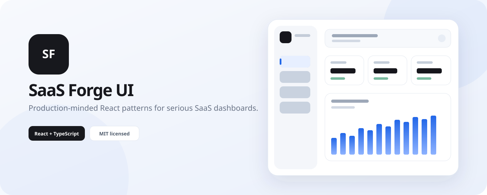

# SaaS Forge UI



**Production-grade React components and UX patterns for serious SaaS dashboards.**

[](https://github.com/Videirafo/saas-forge-ui/actions/workflows/ci.yml)
[](https://github.com/Videirafo/saas-forge-ui/actions/workflows/pages.yml)
[](LICENSE)

**Live demo:** https://videirafo.github.io/saas-forge-ui/

Most component galleries stop at the screenshot. SaaS Forge UI starts where the screenshot stops: mobile behavior, keyboard navigation, reduced motion, persistent preferences, useful empty states, errors and data-heavy surfaces.

## What ships in v0.1

- **Responsive AppShell** — desktop sidebar, compact mode and a distinct mobile drawer.
- **Command palette** — `Ctrl/⌘ + K`, searchable navigation and keyboard-safe focus.
- **Persistent theme** — light/dark preference with system fallback.
- **Data table pattern** — search, selection, status semantics and responsive overflow.
- **State-complete UX** — loading, empty and error patterns designed alongside success states.
- **Accessibility baseline** — semantic structure, skip link, visible focus and `prefers-reduced-motion` support.

## Stack

- React 19
- TypeScript 5.9
- Vite 7
- Tailwind CSS 4
- Phosphor Icons

No backend is required for the demo.

## Run locally

```bash
git clone https://github.com/Videirafo/saas-forge-ui.git
cd saas-forge-ui
npm install
npm run dev
```

Open the local URL shown by Vite.

## Quality gates

```bash
npm run typecheck
npm run build
```

Both run in GitHub Actions for pushes and pull requests.

## Design principles

1. **Responsive by intent.** Mobile is a different interaction mode, not a compressed desktop.
2. **Accessibility is architecture.** Focus, semantics, keyboard and motion preferences are structural requirements.
3. **State-complete patterns.** Loading, empty, error and disabled states belong to the component contract.
4. **Data deserves typography.** Numeric surfaces use tabular/monospace treatment for scanability.
5. **Copy-paste without lock-in.** The code should remain readable enough to own after copying.
6. **Dependencies earn their place.** Prefer platform primitives when an external package does not materially improve the result.

## Why another UI repository?

Most galleries optimize for visual novelty. SaaS Forge UI optimizes for what happens next: the sidebar collapses, the network fails, the table overflows on a phone, the user presses Tab, motion is disabled, or the account has no data yet.

The goal is not to become a giant dependency. The goal is to become a dependable source of patterns teams can understand and own.

## Repository structure

```text
src/
├── components/
│   ├── app-shell.tsx
│   ├── command-palette.tsx
│   ├── data-table.tsx
│   ├── state-showcase.tsx
│   └── theme-toggle.tsx
├── lib/
│   ├── cn.ts
│   └── navigation.tsx
├── App.tsx
├── index.css
└── main.tsx
```

## Contributing

See [CONTRIBUTING.md](CONTRIBUTING.md). Component proposals should start from a real product problem and describe mobile, keyboard and state behavior.

## Roadmap

See [ROADMAP.md](ROADMAP.md). Near-term work includes forms, drawers, filterable grids, visual regression tests and a copy-paste registry. Architecture notes live in [docs/ARCHITECTURE.md](docs/ARCHITECTURE.md).

## License

MIT. See [LICENSE](LICENSE).

---

Built as an open-source engineering project by [Videirafo](https://github.com/Videirafo).
